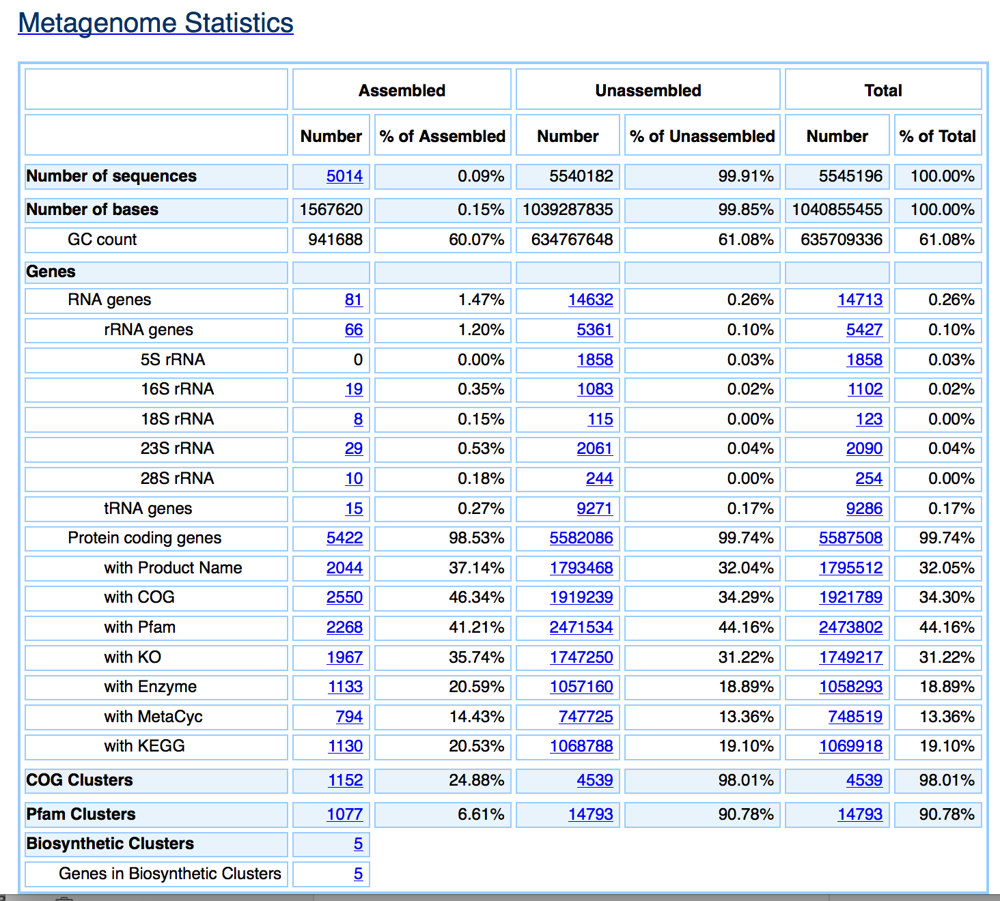

## SDK and Science Target Functionality - JGI IMG/M Metagenome Annotation

### Summary

Users should be able to annotate metagenomes using 3rd party pipelines.

### Story/Description

Annotation of Metagenome will be an important building block to enable KBase to address the needs of the metagenome research community.  The JGI annotation pipeline is well known within the metagenome community and is important for KBase to work with major BER centers like JGI.

The result of this effort would be a fully SDK packaged version of the JGI annotation pipeline.  This would include any dependencies, reference data, and pipeline scripts.

Running the pipeline should be supported on metagnomes up to the current size limit of the system (e.g. 50-100 GB).  A new metagnome annotation data type will likely be required to capture the annotations.  Minimal viewers will need to be developed to provide summary statistics for the annotations.

#### Potential Challenges

- The pipeline is currently being redesigned to decrease resource requirements.  This should make it easier to support the pipeline but may delay availability.

- The pipeline is not currently public accessible.  KBase would need JGI to put their pipeline in a public repository first.

- The pipeline may rely on restricted software (e.g. usearch) that is incompatible with the KBase requirements.

- The pipeline may require parallel execution to annotate a modest size metagenome is a reasonable amount of time (e.g. less than a week)

### User stories

A user can uploaded a modest size metagenome (50-100 GB) and annotate it using the IMG/M pipeline.

The results should be identical to the annotations obtained using the IMG/M service or provide a clear explanation for any variations.

Running an annotation on a modest size metagenome should complete in less than a week (assuming KBase workers are available).

A successful annotation should create a metagenome annotation object and a summary report for the annotation including any warnings about quality or problems.

The annotation service should work with raw metagenome reads.

The annotation service should work with assembled metagenomes.

### Narrative Mockup

### Timeline

This will likely require one to two sprints and bracketed on the availability to the IMG/M pipeline.  One sprint would be need to port the basic pipeline.  A second sprint would be need to refine the pipeline and improve UI/UX.

### Test plan

TODO

### Citations

-  Markowitz VM et al. (2014) IMG 4 version of the integrated microbial genomes comparative analysis system, Nucl. Acids Res. 42, D560-D567.
http://nar.oxfordjournals.org/content/42/D1/D560

- Markowitz VM et al. (2014) IMG/M 4 version of the integrated metagenome comparative analysis system, Nucl. Acids Res. 42, D568-D573.
http://nar.oxfordjournals.org/content/42/D1/D568
